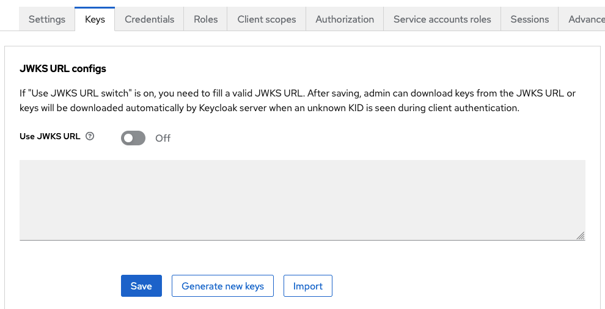
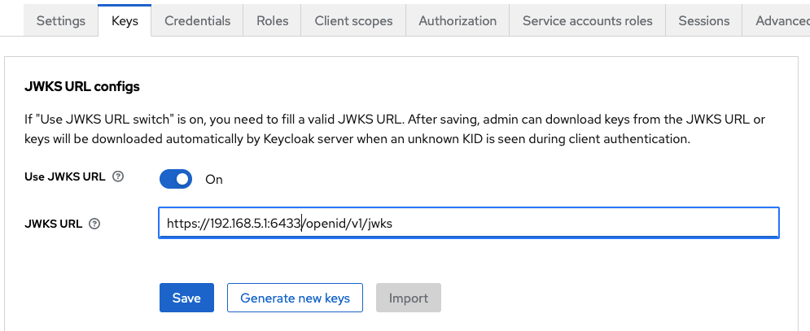

[](https://github.com/chr-fritz/keycloak-kubernetes-authenticator/actions/workflows/build.yaml)
[](https://sonarcloud.io/dashboard?id=chr-fritz_keycloak-kubernetes-authenticator)
[](https://sonarcloud.io/dashboard?id=chr-fritz_keycloak-kubernetes-authenticator)

# Keycloak Kubernetes Client Authenticator

> [!WARNING]
>
> As of **November 2025**, this project is **deprecated**.
> The functionality provided by the keycloak-kubernetes-authenticator is now built into **Keycloak 26.4 and later**
> through the new feature:
>
> > **Federated client authentication (preview)**:
> > Identity providers are now able to federate client authentication. This allows clients to authenticate with SPIFFE
> > JWT SVIDs, Kubernetes service account tokens, or tokens issued by an OpenID Connect identity provider.
>
> See the [Keycloak 26.4 release notes](https://www.keycloak.org/2025/09/keycloak-2640-released) for details.
>
> This extension will **remain compatible with Keycloak versions up to 26.3**, but **no further updates or maintenance**
> will be provided. Please migrate to the native Keycloak functionality for future use.

The Keycloak Kubernetes Client Authenticator is
a [keycloak client authenticator](https://www.keycloak.org/docs/24.0.2/server_development/#_client_authentication) which
allows to use kubernetes service account token as client assertation as described
in [RFC 7523, Section 2.2. Using JWTs for Client Authentication](https://www.rfc-editor.org/rfc/rfc7523.html#section-2.2).
These tokens are created and refreshed through the kubernetes
[ServiceAccount token volume projection](https://kubernetes.io/docs/tasks/configure-pod-container/configure-service-account/#serviceaccount-token-volume-projection).

Using token as client assertation allows to get rid of static credentials like `client_id` and `client_secret` to get
token from keycloak.

## Configuring a client for use

1. Create a new client with your desired client id and set the description
   to
   `system:serviceaccount:<k8s-namespace>:<serviceAccountName>@<kubernetes-issuer-name>`: 
2. Select the `Kubernetes Service Account` Client Authenticator under `Credentials`
3. Provide public key to verify the token signature:
    1. Import a JSON Web Key Set (JWKS): 
    2. Define URL to the JWKS. The default location is
       under `https://<kubernetes-api-server>/openid/v1/jwks`: 

## How to get a token using the kubernetes service account token

The following yaml shows a pod definition that gets a service account token injected into the
file `/var/tokens/keycloak-token`:

```yaml
apiVersion: v1
kind: Pod
metadata:
    name: keycloak-test
spec:
    serviceAccountName: keycloak-test
    containers:
        - name: busybox
          image: busybox:latest
          tty: true
          stdin: true
          volumeMounts:
              # Mount the projected volume `token` under /var/tokens
              - mountPath: /var/tokens
                name: token
    volumes:
        # Create a projected volume that contains one file `keycloak-token`. This file contains the jwt token with the
        # defined audience `http://localhost:8080/realms/master` and is refreshed every two hours.
        - name: token
          projected:
              sources:
                  - serviceAccountToken:
                        path: keycloak-token
                        audience: "http://localhost:8080/realms/master"
                        expirationSeconds: 7200
```

This curl request shows how to get a `client_credential`-token using the injected token form the pod above.

```shell
export KEYCLOAK_REALM_URL=http://localhost:8080/realms/master
export TOKEN=$(cat /var/tokens/keycloak-token)

curl -X POST --location "${KEYCLOAK_REALM_URL}/protocol/openid-connect/token" \
  -H "Authorization: Bearer ${TOKEN}" \
  -H "Content-Type: application/x-www-form-urlencoded" \
  -d 'grant_type=client_credentials&client_assertion_type=urn%3Aietf%3Aparams%3Aoauth%3Aclient-assertion-type%3Ajwt-bearer'

```

## License

The Keycloak Kubernetes Client Authenticator is released under the Apache 2.0 license. See [LICENSE](LICENSE)
